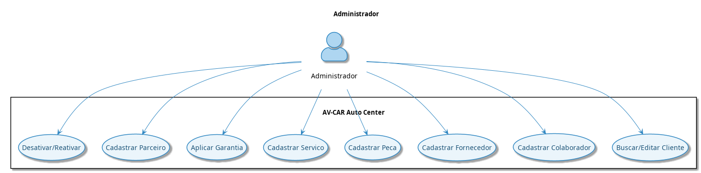
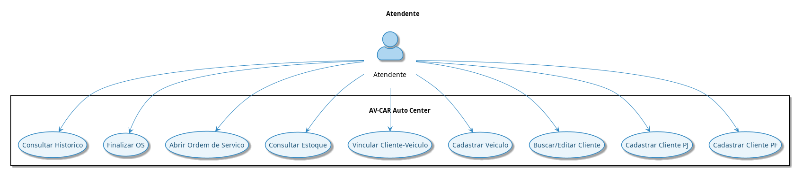
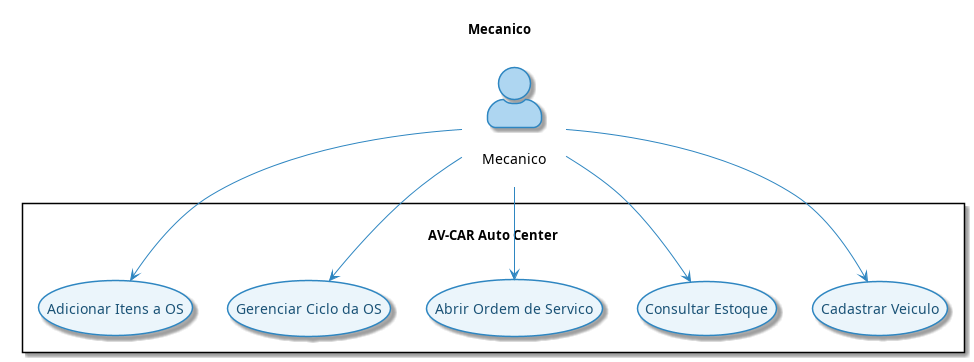
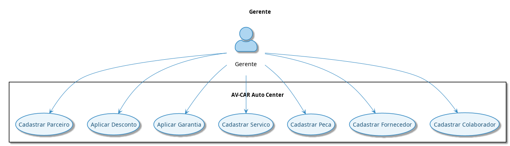
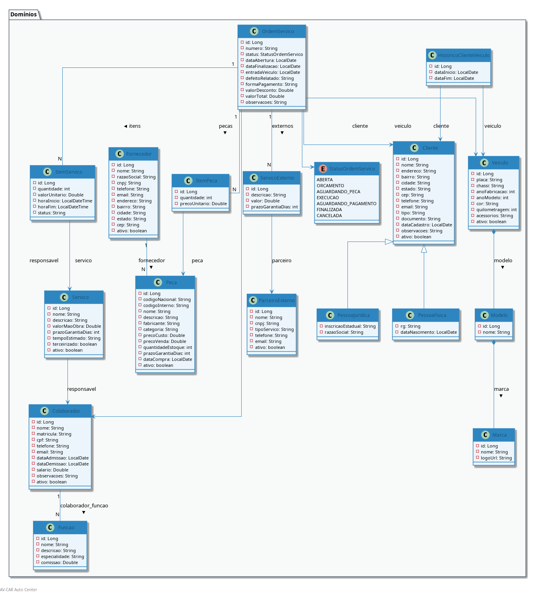

# AV-CAR Auto Center

**Sistema de Gestão de Oficina Mecânica**

| Campo | Descrição |
|-------|-----------|
| **Cliente** | AV-CAR Auto Center |
| **Projeto** | Sistema de Gestão para Oficina Mecânica |
| **Versão** | 1.0.0 |
| **Data** | Junho 2026 |
| **Instituição** | SENAI - FATESG |
| **Stack** | Java 21 + Spring Boot 3.4.1 + JdbcTemplate + PostgreSQL + Swing |

### Repositórios de referência

| Guia | Arquivo |
|------|---------|
| Setup do zero (faculdade) | `SETUP.md` |
| Execução no NetBeans | `BEANS.md` |
| Documento técnico (Estruturas de Dados) | `docs/technical/documento-tecnico-estrutura-dados.md` |
| Especificação completa do sistema | `docs/specs/especificacao-sistema.md` |

---

## i. Estruturas de Dados Implementadas

O pacote `br.edu.senai.fatesg.avcar.datastructures` contém implementações manuais de
estruturas e algoritmos para a disciplina de **Estrutura de Dados I**:

| Estrutura | Arquivo | Onde é usada |
|-----------|---------|--------------|
| **Fila Circular** (`FilaEsperaOS<T>`) | `datastructures/FilaEsperaOS.java` | `FilaEsperaDialog` — fila de espera de OS no Swing |
| **MergeSort** (`mergeSort()`) | `datastructures/OrdenacaoOS.java` | Disponivel para ordenação estável de relatórios |
| **QuickSort** (`quickSort()`) | `datastructures/OrdenacaoOS.java` | `OrdemServicoPanel` — ordenação ao clicar no cabeçalho da tabela |
| **Recursão** (`somarValores`, `fatorial`) | `datastructures/CalculoOS.java` | Cálculo recursivo de totais da OS |

Todas as implementações são **manuais** — sem uso de `Collections.sort`, `Arrays.sort`,
`Stream.sorted` ou `List.sort`. Detalhes completos no
[documento técnico](docs/technical/documento-tecnico-estrutura-dados.md).

---

## ii. Arquitetura do Sistema

O projeto segue uma arquitetura em **bounded contexts** dentro de um único módulo Maven:

```
src/main/java/br/edu/senai/fatesg/avcar/
├── business/               ← domínios de negócio (um pacote por contexto)
│   ├── clientes/           → Cliente, ClienteModel, ClienteDTO, ClienteService...
│   │                       → ClienteFactory (Factory Method)
│   ├── colaboradores/
│   ├── fornecedores/
│   ├── ordemservico/       → OrdemServico, StatusOrdemServico, GarantiaDTO...
│   │                       → OrdemServicoTemplate (Template Method)
│   │                       → OrdemServicoDecorator (Decorator)
│   │                       → OrdemServicoIterator (Iterator)
│   ├── parceiros/          → ParceiroExternoAdapter (Adapter)
│   ├── pecas/              → Peca, ItemPeca, ItemPecaDTO...
│   ├── servicos/           → Servico, ItemServico, ServicoExterno...
│   └── veiculos/           → Veiculo, Marca, Modelo, MarcaDTO...
├── core/                   ← infraestrutura transversal
│   ├── controllers/        → GenericController
│   ├── domains/            → BaseModel, Pessoa
│   ├── dtos/               → BaseDTO
│   ├── exceptions/         → EntidadeNaoEncontradaException, NegocioException...
│   ├── helpers/            → IGenericMapper
│   ├── patterns/           → DatabaseConnectionSingleton (Singleton)
│   ├── repositories/       → AbstractRepository, IGenericRepository
│   ├── services/           → GenericService, IGenericService
│   └── validations/        → GenericValidation, Validator
├── datastructures/         ← estruturas de dados manuais
└── swing/views/            ← interface gráfica Swing
```

Cada domínio em `business/` contém as camadas: **Model** (mapeamento do banco), **DTO** (transferência de dados), **Repository** (interface + impl JdbcTemplate), **Service** (regras de negócio), **Controller** (REST), **Mapper** (Model ↔ DTO) e **Validation** (validações de domínio).

### Padrões de Projeto Implementados

| Padrão | Arquivo | Localização |
|--------|---------|-------------|
| **Singleton** | `DatabaseConnectionSingleton` | `core/patterns/` |
| **Factory Method** | `ClienteFactory` | `business/clientes/` |
| **Adapter** | `ParceiroExternoAdapter` | `business/parceiros/` |
| **Iterator** | `OrdemServicoIterator` | `business/ordemservico/` |
| **Template Method** | `OrdemServicoTemplate` | `business/ordemservico/` |
| **Decorator** | `OrdemServicoDecorator` | `business/ordemservico/` |

---

## iv. Requisitos Específicos

### RE01 — Cadastro de Clientes
O sistema deve permitir cadastrar clientes Pessoa Física (CPF, RG, data de nascimento) e Pessoa Jurídica (CNPJ, inscrição estadual, razão social), armazenando dados de contato, endereço completo (bairro, cidade, estado, CEP) e observações.

### RE02 — Cadastro de Veículos
O sistema deve permitir cadastrar veículos com placa, chassi, ano fabricação, ano modelo, cor, quilometragem, acessórios e vínculo com um modelo/marca. Deve manter histórico de proprietários.

### RE03 — Cadastro de Colaboradores
O sistema deve permitir cadastrar colaboradores com matrícula (automática ou manual), CPF, dados de contato, data de admissão/demissão, salário, observações e vínculo com uma ou mais funções.

### RE04 — Cadastro de Fornecedores
O sistema deve permitir cadastrar fornecedores de peças com CNPJ, razão social, endereço completo e dados de contato.

### RE05 — Cadastro de Peças
O sistema deve permitir cadastrar peças com código nacional, código interno, fabricante, categoria, preço de custo e venda, quantidade em estoque, prazo de garantia, data de compra e fornecedor de origem.

### RE06 — Cadastro de Serviços
O sistema deve permitir cadastrar serviços com descrição, valor de mão-de-obra, prazo de garantia, tempo estimado e responsável técnico.

### RE07 — Cadastro de Parceiros Externos
O sistema deve permitir cadastrar empresas terceirizadas (funilaria, guincho, vidros) com CNPJ, tipo de serviço e dados de contato.

### RE08 — Ordem de Serviço (OS)
O sistema deve gerenciar o ciclo de vida completo de ordens de serviço: abertura, orçamento, execução, pausa para aguardar peças, finalização e cancelamento.

### RE09 — Itens de OS
O sistema deve permitir associar serviços, peças e serviços externos a uma OS com quantidades, valores unitários e controle de horário de execução.

### RE10 — Garantia e Desconto
O sistema deve permitir calcular garantia de serviços e peças, aplicar garantia estendida e descontos percentuais sobre a OS.

### RE11 — Soft Delete
O sistema deve permitir desativação lógica de clientes, veículos, colaboradores, fornecedores, peças, serviços e parceiros sem excluir dados do banco.

---

## v. Requisitos Funcionais

| ID | Módulo | Descrição | Prioridade |
|----|--------|-----------|------------|
| RF01 | Cliente | Criar cliente PF com nome, CPF, RG, dataNascimento, telefone, email, endereço completo, observações | Alta |
| RF02 | Cliente | Criar cliente PJ com nome, CNPJ, inscricaoEstadual, razaoSocial, telefone, email, endereço completo | Alta |
| RF03 | Cliente | Listar, buscar por nome, atualizar e alternar ativo/inativo | Alta |
| RF04 | Veículo | Criar veículo com placa, chassi, anoFabricacao, anoModelo, cor, quilometragem, modelo, cliente | Alta |
| RF05 | Veículo | Buscar por placa, listar por cliente, listar marcas e modelos | Alta |
| RF06 | Veículo | Manter histórico de proprietários (data_inicio/data_fim) | Média |
| RF07 | Colaborador | Criar colaborador com matrícula automática (COL + ID) | Alta |
| RF08 | Colaborador | Associar múltiplas funções (N:N) | Alta |
| RF09 | Colaborador | Listar, buscar, atualizar, toggle-status | Alta |
| RF10 | Fornecedor | CRUD completo com endereço completo e toggle-status | Alta |
| RF11 | Peça | CRUD completo com código interno, fabricante, categoria, estoque, fornecedor | Alta |
| RF12 | Peça | Alertar estoque baixo (abaixo do mínimo configurável) | Média |
| RF13 | Serviço | CRUD completo com tempo estimado, garantia, responsável técnico | Alta |
| RF14 | Parceiro | CRUD completo com tipo de serviço e toggle-status | Média |
| RF15 | OS | Criar OS vinculada a veículo, cliente e responsável técnico | Alta |
| RF16 | OS | Avançar ciclo: Aberta → Orçamento → Execução → Pagamento → Finalizada | Alta |
| RF17 | OS | Pausar OS (Aguardando Peça) | Alta |
| RF18 | OS | Cancelar OS de qualquer status não-terminal | Alta |
| RF19 | OS | Adicionar/remover itens de serviço, peça e serviços externos | Alta |
| RF20 | OS | Calcular valor total automaticamente pela soma dos itens | Alta |
| RF21 | OS | Aplicar garantia estendida (Decorator) e desconto percentual | Média |
| RF22 | OS | Listar OS por status e por veículo/cliente | Média |
| RF23 | Geral | Soft delete em todas as entidades principais | Alta |
| RF24 | Geral | Interface gráfica desktop (Swing) consumindo API REST | Alta |

---

## vi. Requisitos de Qualidade ou Não Funcionais

| ID | Tipo | Descrição |
|----|------|-----------|
| RNF01 | Desempenho | API deve responder em menos de 2s para consultas de listagem |
| RNF02 | Desempenho | Consultas SQL devem usar índices nas colunas de filtro (placa, CPF, CNPJ, status OS, nome) |
| RNF03 | Arquitetura | API REST com Spring Boot 3.4.1 e JdbcTemplate (sem JPA) |
| RNF04 | Arquitetura | Cliente desktop Java Swing desacoplado via HTTP REST |
| RNF05 | Persistência | PostgreSQL 16+ com schema versionado via SQL script |
| RNF06 | Segurança | Senhas armazenadas com SHA-512 (compatível com legado) |
| RNF07 | Segurança | Autenticação via sessão HTTP (JSESSIONID) |
| RNF08 | Disponibilidade | Sistema local (single-tenant), sem dependência de nuvem |
| RNF09 | Manutenibilidade | Projeto Maven single-module com pacotes organizados por bounded context: `business/` (domínios), `core/` (infraestrutura), `swing/` (UI), `datastructures/` |
| RNF10 | Manutenibilidade | Código-fonte em português (domínio) e inglês (técnico) |
| RNF11 | Compatibilidade | Java 21+ obrigatório para compilação e execução |
| RNF12 | Tratamento de Erros | Exceções de negócio mapeadas para HTTP 422; não encontrado para 404 |
| RNF13 | UI/UX | Interface desktop responsiva com tabelas, formulários e navegação por abas |

---

## vii. Regras de Domínio

| ID | Regra | Descrição |
|----|-------|-----------|
| RD01 | Histórico de Propriedade | Veículo pode ter múltiplos proprietários ao longo do tempo. O sistema deve registrar em `historico_cliente_veiculo` com data de início/fim. O proprietário atual é o registro com `data_fim IS NULL`. |
| RD02 | Vínculo da OS | A Ordem de Serviço pertence ao veículo, independente do proprietário no momento da execução. |
| RD03 | Rastreabilidade de Peças | Cada peça deve estar vinculada a um fornecedor para permitir acionamento de garantia. |
| RD04 | Vigência da Garantia | O prazo de garantia de peças e serviços começa a contar na data de finalização da OS. |
| RD05 | Responsabilidade Técnica | Todo serviço registrado em uma OS deve ter um colaborador responsável pela execução. |
| RD06 | Ciclo de Vida da OS | O status da OS segue um fluxo determinístico: ABERTA → ORCAMENTO → EXECUCAO → AGUARDANDO_PAGAMENTO → FINALIZADA. Pode ser pausada para AGUARDANDO_PECA ou cancelada para CANCELADA. |
| RD07 | Matrícula Automática | Se a matrícula do colaborador não for informada, o sistema gera automaticamente no formato "COL" + ID sequencial. |
| RD08 | Split Cliente PF/PJ | Clientes PF e PJ compartilham a tabela base `cliente`. Dados específicos de PF (RG, dataNascimento) ficam em `cliente_pf`; dados de PJ (inscricaoEstadual, razaoSocial) ficam em `cliente_pj`. |
| RD09 | Cálculo do Valor Total | O valor total da OS é calculado pela soma de: `(quantidade × valorUnitario)` dos itens de serviço + `(quantidade × precoUnitario)` dos itens de peça + `valor` dos serviços externos. |
| RD10 | Soft Delete | Todas as entidades principais possuem flag `ativo` booleano. Consultas de listagem excluem registros inativos por padrão. A exclusão física não é permitida. |

---

## viii. Restrições

| ID | Restrição | Descrição |
|----|-----------|-----------|
| RES01 | Linguagem | Java 21+ obrigatório. Código deve compilar com `mvn clean package -DskipTests` |
| RES02 | Banco | PostgreSQL 16+. Schema gerenciado exclusivamente por `db/schema.sql`. Sem migration framework (Flyway/Liquibase). |
| RES03 | ORM | Proibido uso de JPA/Hibernate. Todo acesso a dados via JdbcTemplate com SQL nativo. |
| RES04 | Dados Legados | Hashes SHA-512 existentes devem ser preservados para compatibilidade com sistema .NET legado. |
| RES05 | Autenticação | Sessão HTTP (JSESSIONID) obrigatória. JWT não permitido. |
| RES06 | Modularização | Projeto Maven single-module com pacotes organizados por bounded context: `business/{dominio}/` (Model, DTO, Repository, Service, Controller, Mapper, Validation por domínio), `core/` (BaseModel, BaseDTO, exceções, repositório genérico, design patterns), `swing/` (UI), `datastructures/` |
| RES07 | DTOs | Comunicação entre camadas exclusivamente via DTOs. Domínios não podem vazar para a camada de apresentação. |
| RES08 | Zero Stubs | Nenhum stub, TODO ou implementação vazia é permitida. Todo endpoint deve ter implementação completa. |
| RES09 | Porta | API deve rodar na porta 8080 por padrão. |
| RES10 | Nomenclatura | Tabelas no banco em português (snake_case). Classes Java em inglês (camelCase). |

---

## ix. Descrição dos Dados do Sistema

### Tabelas do Banco de Dados (18 tabelas)

#### `marca`
| Coluna | Tipo | Descrição |
|--------|------|-----------|
| id | SERIAL PK | Identificador único |
| nome | VARCHAR(100) NOT NULL | Nome da marca |
| logo_url | VARCHAR(255) | URL do logotipo |

#### `modelo`
| Coluna | Tipo | Descrição |
|--------|------|-----------|
| id | SERIAL PK | Identificador único |
| nome | VARCHAR(100) NOT NULL | Nome do modelo |
| marca_id | INTEGER FK → marca(id) | Marca do veículo |

#### `cliente`
| Coluna | Tipo | Descrição |
|--------|------|-----------|
| id | SERIAL PK | Identificador único |
| nome | VARCHAR(200) NOT NULL | Nome/Razão Social |
| endereco | VARCHAR(300) | Logradouro |
| bairro | VARCHAR(100) | Bairro |
| cidade | VARCHAR(100) | Cidade |
| estado | VARCHAR(50) | Estado/UF |
| cep | VARCHAR(10) | CEP |
| telefone | VARCHAR(20) | Telefone de contato |
| email | VARCHAR(100) | E-mail |
| tipo | VARCHAR(2) CHECK (PF/PJ) | Tipo de pessoa |
| documento | VARCHAR(20) NOT NULL | CPF ou CNPJ |
| data_cadastro | DATE DEFAULT CURRENT_DATE | Data de cadastro |
| observacoes | TEXT | Observações gerais |
| ativo | BOOLEAN DEFAULT TRUE | Soft delete |

#### `cliente_pf`
| Coluna | Tipo | Descrição |
|--------|------|-----------|
| id | SERIAL PK | Identificador único |
| cliente_id | INTEGER UNIQUE FK → cliente(id) | Cliente PF correspondente |
| rg | VARCHAR(20) | RG |
| data_nascimento | DATE | Data de nascimento |

#### `cliente_pj`
| Coluna | Tipo | Descrição |
|--------|------|-----------|
| id | SERIAL PK | Identificador único |
| cliente_id | INTEGER UNIQUE FK → cliente(id) | Cliente PJ correspondente |
| inscricao_estadual | VARCHAR(20) | Inscrição estadual |
| razao_social | VARCHAR(200) | Razão social |

#### `veiculo`
| Coluna | Tipo | Descrição |
|--------|------|-----------|
| id | SERIAL PK | Identificador único |
| placa | VARCHAR(10) UNIQUE NOT NULL | Placa do veículo |
| chassi | VARCHAR(30) | Número do chassi |
| ano_fabricacao | INTEGER NOT NULL | Ano de fabricação |
| ano_modelo | INTEGER NOT NULL | Ano do modelo |
| cor | VARCHAR(50) | Cor predominante |
| quilometragem | INTEGER DEFAULT 0 | Quilometragem atual |
| acessorios | TEXT | Acessórios do veículo |
| modelo_id | INTEGER FK → modelo(id) | Modelo do veículo |
| ativo | BOOLEAN DEFAULT TRUE | Soft delete |

#### `historico_cliente_veiculo`
| Coluna | Tipo | Descrição |
|--------|------|-----------|
| id | SERIAL PK | Identificador único |
| veiculo_id | INTEGER FK → veiculo(id) | Veículo |
| cliente_id | INTEGER FK → cliente(id) | Proprietário |
| data_inicio | DATE NOT NULL | Início da propriedade |
| data_fim | DATE | Fim da propriedade (NULL = atual) |

#### `funcao`
| Coluna | Tipo | Descrição |
|--------|------|-----------|
| id | SERIAL PK | Identificador único |
| nome | VARCHAR(100) NOT NULL | Nome da função |
| descricao | VARCHAR(300) | Descrição |
| especialidade | VARCHAR(100) | Especialidade |
| comissao | DECIMAL(5,2) | Percentual de comissão |

#### `colaborador`
| Coluna | Tipo | Descrição |
|--------|------|-----------|
| id | SERIAL PK | Identificador único |
| nome | VARCHAR(200) NOT NULL | Nome completo |
| matricula | VARCHAR(20) UNIQUE NOT NULL | Matrícula funcional |
| cpf | VARCHAR(11) UNIQUE NOT NULL | CPF |
| telefone | VARCHAR(20) | Telefone de contato |
| email | VARCHAR(100) | E-mail |
| data_admissao | DATE DEFAULT CURRENT_DATE | Data de admissão |
| data_demissao | DATE | Data de demissão |
| salario | DECIMAL(10,2) | Salário |
| observacoes | TEXT | Observações |
| ativo | BOOLEAN DEFAULT TRUE | Soft delete |

#### `colaborador_funcao`
| Coluna | Tipo | Descrição |
|--------|------|-----------|
| colaborador_id | INTEGER FK → colaborador(id) | Colaborador |
| funcao_id | INTEGER FK → funcao(id) | Função |
| PK | (colaborador_id, funcao_id) | Chave composta |

#### `fornecedor`
| Coluna | Tipo | Descrição |
|--------|------|-----------|
| id | SERIAL PK | Identificador único |
| razaosocial | VARCHAR(200) | Razão social |
| cnpj | VARCHAR(18) NOT NULL | CNPJ |
| ddi | VARCHAR(10) DEFAULT '55' | DDI |
| ddd | VARCHAR(10) | DDD |
| numerofornecedor | VARCHAR(20) | Número de telefone |
| email | VARCHAR(255) | E-mail |
| enderecofornecedor | VARCHAR(255) | Logradouro |
| bairrofornecedor | VARCHAR(100) | Bairro |
| cidadefornecedor | VARCHAR(100) | Cidade |
| estadofornecedor | VARCHAR(50) | Estado/UF |
| cepfornecedor | INTEGER | CEP |

#### `peca`
| Coluna | Tipo | Descrição |
|--------|------|-----------|
| id | SERIAL PK | Identificador único |
| codigo_nacional | VARCHAR(50) UNIQUE NOT NULL | Código de identificação nacional |
| codigo_interno | VARCHAR(50) | Código interno da oficina |
| nome | VARCHAR(200) NOT NULL | Nome da peça |
| descricao | VARCHAR(500) | Descrição detalhada |
| fabricante | VARCHAR(100) | Fabricante |
| categoria | VARCHAR(100) | Categoria |
| preco_custo | DECIMAL(10,2) NOT NULL | Preço de custo |
| preco_venda | DECIMAL(10,2) NOT NULL | Preço de venda |
| quantidade_estoque | INTEGER DEFAULT 0 | Quantidade em estoque |
| prazo_garantia_dias | INTEGER DEFAULT 180 | Prazo de garantia em dias |
| data_compra | DATE | Data da compra |
| fornecedor_id | INTEGER FK → fornecedor(id) | Fornecedor de origem |
| ativo | BOOLEAN DEFAULT TRUE | Soft delete |

#### `parceiro_externo`
| Coluna | Tipo | Descrição |
|--------|------|-----------|
| id | SERIAL PK | Identificador único |
| nome | VARCHAR(200) NOT NULL | Nome do parceiro |
| cnpj | VARCHAR(14) UNIQUE NOT NULL | CNPJ |
| tipo_servico | VARCHAR(100) | Tipo de serviço prestado |
| telefone | VARCHAR(20) | Telefone de contato |
| email | VARCHAR(100) | E-mail |
| ativo | BOOLEAN DEFAULT TRUE | Soft delete |

#### `servico`
| Coluna | Tipo | Descrição |
|--------|------|-----------|
| id | SERIAL PK | Identificador único |
| nome | VARCHAR(200) NOT NULL | Nome do serviço |
| descricao | VARCHAR(500) | Descrição |
| valor_mao_obra | DECIMAL(10,2) NOT NULL | Valor da mão-de-obra |
| prazo_garantia_dias | INTEGER DEFAULT 90 | Prazo de garantia em dias |
| tempo_estimado | VARCHAR(50) | Tempo estimado de execução |
| responsavel_id | INTEGER FK → colaborador(id) | Responsável técnico |
| terceirizado | BOOLEAN DEFAULT FALSE | Se é serviço terceirizado |
| ativo | BOOLEAN DEFAULT TRUE | Soft delete |

#### `ordem_servico`
| Coluna | Tipo | Descrição |
|--------|------|-----------|
| id | SERIAL PK | Identificador único |
| numero | VARCHAR(20) UNIQUE NOT NULL | Número da OS |
| veiculo_id | INTEGER FK → veiculo(id) | Veículo atendido |
| cliente_id | INTEGER FK → cliente(id) | Cliente |
| responsavel_id | INTEGER FK → colaborador(id) | Responsável técnico |
| status | VARCHAR(30) DEFAULT 'ABERTA' | Status do ciclo de vida |
| data_abertura | DATE DEFAULT CURRENT_DATE | Data de abertura |
| data_finalizacao | DATE | Data de finalização |
| entrada_veiculo | DATE | Data de entrada do veículo |
| defeito_relatado | TEXT | Defeito reportado pelo cliente |
| forma_pagamento | VARCHAR(100) | Forma de pagamento |
| valor_desconto | DECIMAL(10,2) DEFAULT 0 | Valor do desconto |
| valor_total | DECIMAL(10,2) DEFAULT 0 | Valor total calculado |
| observacoes | TEXT | Observações |

#### `item_servico`
| Coluna | Tipo | Descrição |
|--------|------|-----------|
| id | SERIAL PK | Identificador único |
| ordem_servico_id | INTEGER FK → ordem_servico(id) | OS pai |
| servico_id | INTEGER FK → servico(id) | Serviço executado |
| quantidade | INTEGER DEFAULT 1 | Quantidade |
| valor_unitario | DECIMAL(10,2) NOT NULL | Valor unitário |
| hora_inicio | TIMESTAMP | Início da execução |
| hora_fim | TIMESTAMP | Fim da execução |
| status | VARCHAR(30) | Status do item |

#### `item_peca`
| Coluna | Tipo | Descrição |
|--------|------|-----------|
| id | SERIAL PK | Identificador único |
| ordem_servico_id | INTEGER FK → ordem_servico(id) | OS pai |
| peca_id | INTEGER FK → peca(id) | Peça utilizada |
| quantidade | INTEGER DEFAULT 1 | Quantidade |
| preco_unitario | DECIMAL(10,2) NOT NULL | Preço unitário |

#### `servico_externo`
| Coluna | Tipo | Descrição |
|--------|------|-----------|
| id | SERIAL PK | Identificador único |
| ordem_servico_id | INTEGER FK → ordem_servico(id) | OS pai |
| parceiro_id | INTEGER FK → parceiro_externo(id) | Parceiro executor |
| descricao | VARCHAR(500) | Descrição do serviço |
| valor | DECIMAL(10,2) NOT NULL | Valor cobrado |
| prazo_garantia_dias | INTEGER DEFAULT 90 | Prazo de garantia em dias |

---

## x. Modelo Conceitual, Lógico e Físico

### Modelo Conceitual (MER)

```
┌─────────────────────────────────────────────────────────────────────────────┐
│                              AV-CAR Auto Center                              │
├─────────────────────────────────────────────────────────────────────────────┤
│                                                                              │
│  Marca ──1:N──> Modelo ──1:N──> Veiculo                                      │
│                                    │                                          │
│                                    │ 1:N                                      │
│                                    ▼                                          │
│  Cliente ──1:N──> HistoricoClienteVeiculo ──N:1──> Veiculo                   │
│     │                                                                         │
│     │ (1:1)                OrdemServico ──N:1──> Veiculo                     │
│     ├── ClientePF           │              N:1──> Cliente                    │
│     └── ClientePJ           │              N:1──> Colaborador                │
│                              │                                                │
│  Colaborador ──N:N──> Funcao │                                                │
│                              │ 1:N                                            │
│  Fornecedor ──1:N──> Peca   ▼                                                │
│                         ItemServico ──N:1──> Servico                         │
│                         ItemPeca    ──N:1──> Peca                            │
│                         ServicoExterno ──N:1──> ParceiroExterno              │
│                                                                              │
└─────────────────────────────────────────────────────────────────────────────┘
```

### Modelo Lógico

```
marca (id, nome, logo_url)
  │
  └── modelo (id, nome, marca_id FK → marca)
        │
        └── veiculo (id, placa, chassi, ano_fabricacao, ano_modelo, cor,
                     quilometragem, acessorios, modelo_id FK → modelo, ativo)

cliente (id, nome, endereco, bairro, cidade, estado, cep,
         telefone, email, tipo PF/PJ, documento, data_cadastro, observacoes, ativo)
  │
  ├── cliente_pf (id, cliente_id FK UNIQUE → cliente, rg, data_nascimento)
  └── cliente_pj (id, cliente_id FK UNIQUE → cliente, inscricao_estadual, razao_social)

historico_cliente_veiculo (id, veiculo_id FK → veiculo, cliente_id FK → cliente,
                           data_inicio, data_fim)

funcao (id, nome, descricao, especialidade, comissao)

colaborador (id, nome, matricula UNIQUE, cpf UNIQUE, telefone, email,
             data_admissao, data_demissao, salario, observacoes, ativo)

colaborador_funcao (colaborador_id FK → colaborador, funcao_id FK → funcao)
              PK = (colaborador_id, funcao_id)

fornecedor (id, nome, razao_social, cnpj UNIQUE, telefone, email,
            endereco, bairro, cidade, estado, cep, ativo)

peca (id, codigo_nacional UNIQUE, codigo_interno, nome, descricao,
      fabricante, categoria, preco_custo, preco_venda, quantidade_estoque,
      prazo_garantia_dias, data_compra, fornecedor_id FK → fornecedor, ativo)

parceiro_externo (id, nome, cnpj UNIQUE, tipo_servico, telefone, email, ativo)

servico (id, nome, descricao, valor_mao_obra, prazo_garantia_dias,
         tempo_estimado, responsavel_id FK → colaborador, terceirizado, ativo)

ordem_servico (id, numero UNIQUE, veiculo_id FK → veiculo,
               cliente_id FK → cliente, responsavel_id FK → colaborador,
               status, data_abertura, data_finalizacao, entrada_veiculo,
               defeito_relatado, forma_pagamento, valor_desconto,
               valor_total, observacoes)

item_servico (id, ordem_servico_id FK → ordem_servico,
              servico_id FK → servico, quantidade, valor_unitario,
              hora_inicio, hora_fim, status)

item_peca (id, ordem_servico_id FK → ordem_servico,
           peca_id FK → peca, quantidade, preco_unitario)

servico_externo (id, ordem_servico_id FK → ordem_servico,
                 parceiro_id FK → parceiro_externo, descricao,
                 valor, prazo_garantia_dias)
```

### Modelo Físico

O script DDL completo encontra-se em `db/schema.sql` (18 tabelas, ~190 linhas). Inclui:

- Constraints `NOT NULL`, `UNIQUE`, `PRIMARY KEY`, `FOREIGN KEY`
- `CHECK` constraint para `cliente.tipo IN ('PF', 'PJ')`
- `DEFAULT` values para datas, valores booleanos e numéricos
- Relacionamentos com `ON DELETE CASCADE` em cliente_pf/cliente_pj
- Sequências auto-incremento via `SERIAL`

---

## xi. Diagrama de Casos de Uso









---

## xii. Diagrama de Classe



---

*Documento gerado em Junho de 2026. Para o schema DDL atualizado, consulte `db/schema.sql`.*
